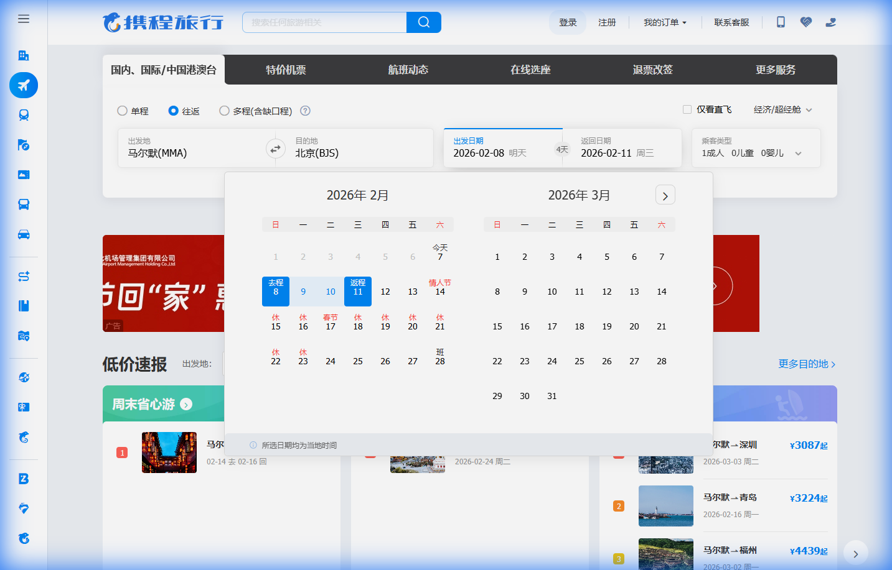

# 👋 OpenManus

I built this project based on the open-source [OpenManus](https://github.com/FoundationAgents/OpenManus). It is a powerful implementation of a general-purpose AI agent capable of navigating the web, executing code, and solving complex tasks.

## 🚀 Key Feature: Exclusive Memory

One of the major engineering pain points I encountered in web automation is **DOM parsing inaccuracies**. In many dynamic web pages, elements like date pickers, dropdowns, and modals are extremely difficult for LLMs to interpret correctly from raw HTML or truncated accessibility trees.

Take a look at a typical flight search page like Ctrip:

*The sheer density of elements, nested structures, and dynamic overlays make it a nightmare for traditional DOM-to-Text parsing.*

I solve this problem through my **"Exclusive Memory"** mechanism, which consists of two core components:

### 1. Semantic Element Classifier
My `ElementClassifier` automatically categorizes DOM elements into semantic categories (like `DATE`, `CALENDAR`, `BUTTON`, `INPUT`) and calculates a confidence score. This provides the LLM with a high-level, structured understanding of the page, ensuring it picks the right element even when the underlying DOM structure is messy.

**Code Implementation snippet from `app/tool/element_classifier.py`:**

```python
class ElementCategory(Enum):
    DATE = "DATE"           # Date-related elements
    CALENDAR = "CALENDAR"   # Calendar widgets
    BUTTON = "BUTTON"       # Interaction buttons
    INPUT = "INPUT"         # Text inputs
    # ... other categories

class ElementClassifier:
    def classify_element(self, index, tag_name, text, attributes):
        # Semantic analysis logic
        if self._is_calendar_date(text, tag_lower, all_attrs):
            return ElementCategory.CALENDAR, 95
        # ... classification logic
```

### 2. Knowledge-Driven Optimization
I designed the agent to utilize a specialized "Knowledge Base" (located in the `knowledge/` directory) to "remember" the most efficient ways to interact with specific websites. For example, instead of struggling with complex calendar UI widgets on travel sites, my agent knows how to use direct URL parameters for navigation.

## 💡 Example: Flight Search

When you ask the agent to "Search for flights from Shanghai to Beijing on 2026-01-30", instead of clicking through multiple date pickers, it uses its "Exclusive Memory" to navigate directly:

**Knowledge Base Example (`knowledge/travel_tools.txt`):**
```text
Ctrip Flight URL Format:
https://flights.ctrip.com/online/list/oneway-{departure_city_code}-{arrival_city_code}?depdate={date_YYYY-MM-DD}
```

This approach drastically improves success rates and reduces token consumption.

## 🛠️ Installation & Usage

### 1. Install Dependencies
```bash
pip install -r requirements.txt
playwright install
```

### 2. Configure
Copy the example config and add your API keys:
```bash
cp config/config.example.toml config/config.toml
```

### 3. Run
```bash
python main.py
```

## 📚 Examples & Use Cases

Check out more detailed examples of how the agent handles various scenarios, including flight queries and complex travel planning, in the [Examples Directory](examples/use_case/readme.md).

## 📅 TODO

- [ ] **Vision-based Fallback:** Implement a vision-driven backup mechanism (LLM Vision) to handle edge cases where semantic DOM classification and knowledge-based rules still cannot accurately identify interactive elements.

